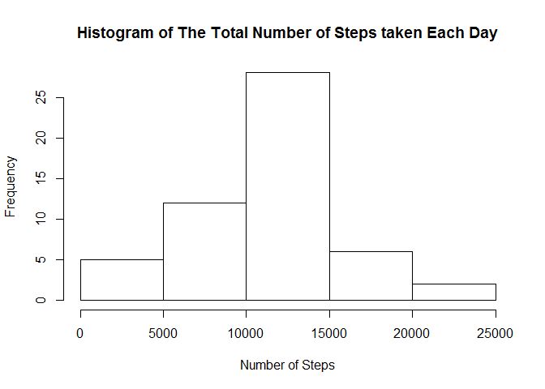
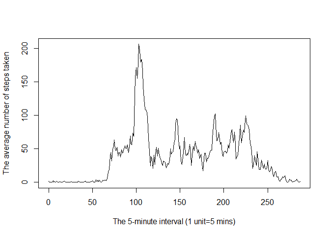
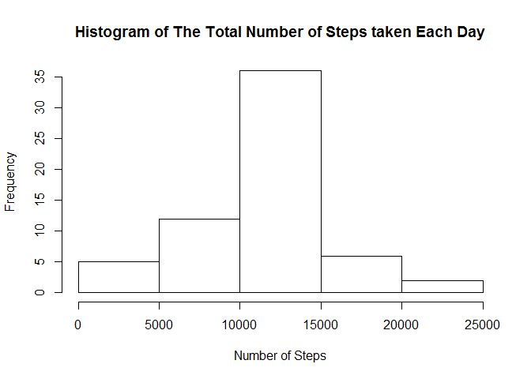
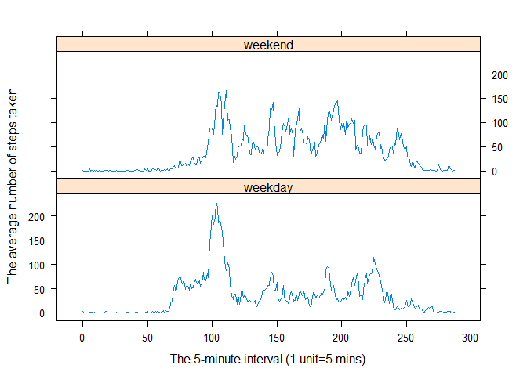

# Reproducible Research: Peer Assessment 1


## Loading and preprocessing the data

```r
unzip("activity.zip")
data<-read.csv("activity.csv")
data$steps<-as.numeric(data$steps)
```

## What is mean total number of steps taken per day?

```r
tot_perday <- aggregate(data$steps, by=list(data$date), FUN=sum)
hist(tot_perday$x, main="Histogram of The Total Number of Steps taken Each Day", xlab="Number of Steps")
```

 

```r
mean <- mean(tot_perday$x, na.rm=T)
median <- median(tot_perday$x, na.rm=T)
```
The mean of the total number of steps taken per day is 1.0766189\times 10^{4} and the median of the total number of steps taken per day is 1.0765\times 10^{4}.

## What is the average daily activity pattern?

```r
avg_perint <- aggregate(data$steps, by=list(data$interval), FUN=mean, na.rm=T)
avg_perint$Group.2 <- seq(1:288)-1
plot(avg_perint$Group.2,avg_perint$x,type="l",xlab="The 5-minute interval (1 unit=5 mins)",ylab="The average number of steps taken")
```

 

```r
int_maxsteps <- avg_perint[avg_perint$x==max(avg_perint$x),]
```
The 835 5-minute interval, on average across all the days in the dataset, contains the maximum number of steps 

## Imputing missing values

```r
nrow_missing <- nrow(data[data$steps=="NA",])
```
The total number of missing values in the dataset: 2304.

### Replace missing values by the mean for that 5-minute interval 

```r
avg_perint <- aggregate(data$steps, by=list(data$interval), FUN=mean, na.rm=T)
temp <- merge(data,avg_perint, by.x = "interval", by.y = "Group.1")
temp$steps[is.na(temp$steps)] <- temp$x[is.na(temp$steps)]
newdata <- temp[,-4]
```


```r
tot_perday_new <- aggregate(newdata$steps, by=list(newdata$date), FUN=sum)
hist(tot_perday_new$x, main="Histogram of The Total Number of Steps taken Each Day", xlab="Number of Steps")
```

 

```r
mean_new <- mean(tot_perday_new$x, na.rm=T)
median_new <- median(tot_perday_new$x, na.rm=T)
```
The mean of the total number of steps taken per day is 1.0766189\times 10^{4} and the median of the total number of steps taken per day is 1.0766189\times 10^{4}.

The mean does not differ from the estimate from the first part of the assignment. The median is changed and equal to the mean.   

## Are there differences in activity patterns between weekdays and weekends?

```r
newdata$date <- strptime(newdata$date, format="%Y-%m-%d")
newdata$day <- factor((weekdays(newdata$date) %in% c("Saturday","Sunday"))+1L, levels=1:2, labels=c('weekday', 'weekend'))

avg_perint_new <- aggregate(newdata$steps, by=list(newdata$interval,newdata$day), FUN=mean, na.rm=T)
avg_perint_new$Group.3 <- rep(seq(1:288)-1,2)

library(lattice)
xyplot(x ~ Group.3 | Group.2, data=avg_perint_new, layout=c(1,2), type="l", xlab="The 5-minute interval (1 unit=5 mins)", ylab="The average number of steps taken")
```

 

